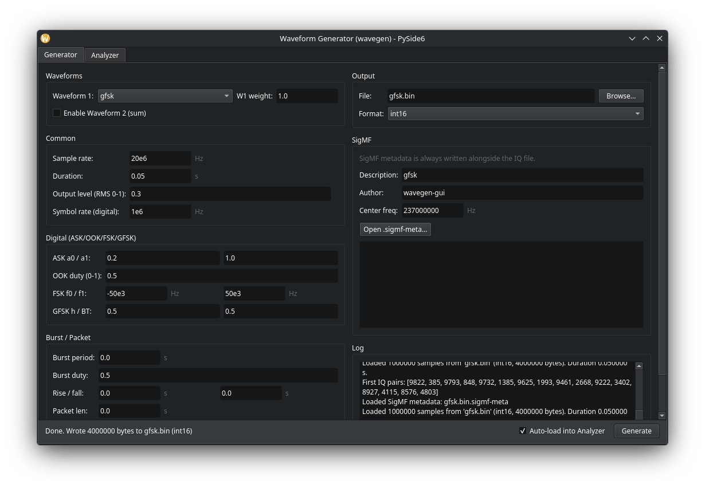
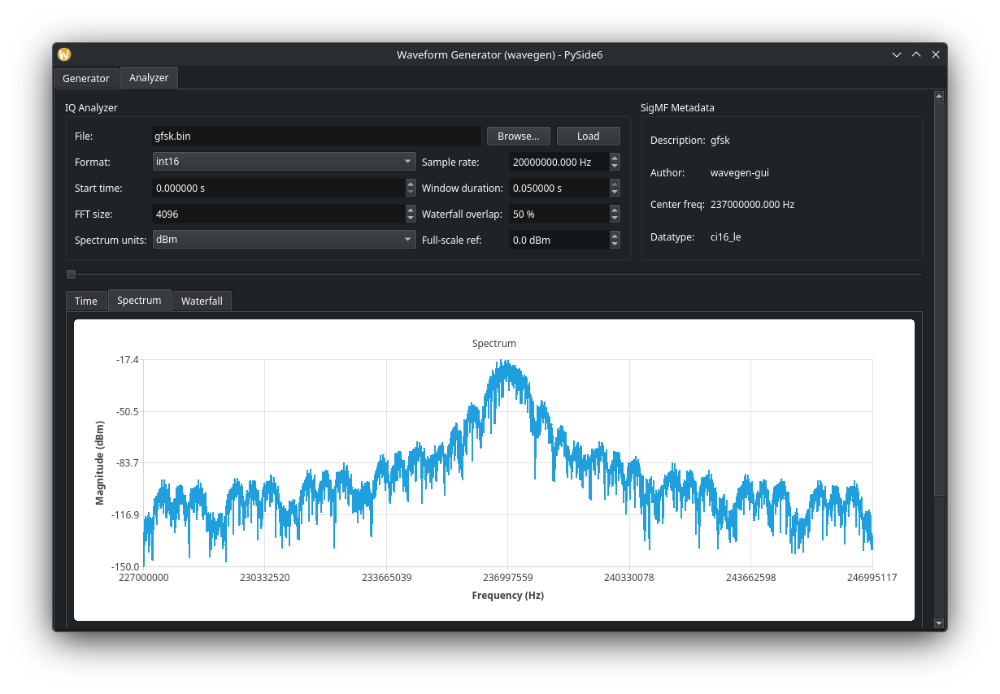

# SDR Waveform Generator (USRP and other SDRs)

Modular generator for complex baseband IQ waveforms with a GUI analyzer with integration of SigMF for the creation and ingestion of meta data for use with other applications.
Targets lab testing with Ettus USRP, HackRF, and other SDRs that accept
raw IQ files.

Generates interleaved IQ samples:

```
I0, Q0, I1, Q1, ...
```

You can play the output with GNU Radio, UHD, or custom SDR code.

## Entry Points

- `wavegen.py`: core library and CLI
- `wavegen_gui_pyside6.py`: PySide6 GUI (generator + analyzer)

## Installation

Requirements:

- Python 3.8+
- `numpy`
- `PySide6` and `PySide6-Addons` (QtCharts)
- `matplotlib` (for waterfall)

Install dependencies:

```bash
pip install numpy pyside6 pyside6-addons matplotlib
```

## Output Formats

- Complex baseband IQ
- Interleaved samples: `I0, Q0, I1, Q1, ...`
- Formats:
  - `int16` (USRP-style)
  - `int8` (HackRF sc8)

Make sure your SDR sample rate matches `--fs`.

## Screenshots

Generator:



Analyzer Spectrum View and Controls:



Analyzer Waterfall View and Mesurements:


## Supported Waveforms

All waveforms are generated at complex baseband with sampling rate `fs`.

1) Noise and RF test signals
- `noise`: band-limited complex noise
- `cw`: single complex tone
- `multitone`: sum of user-defined tones
- `two_tone`: classic 2-tone IMD/IP3 test

2) Analog modulations
- `am`: AM (DSB with carrier)
- `fm`: FM with single-tone modulator
- `pm`: phase modulation

3) Digital modulations
- `ask`: binary amplitude shift keying
- `ook`: on-off keying
- `fsk2`: 2-FSK
- `gfsk`: approximate GFSK (smoothed FSK)
- `bpsk`: baseband BPSK
- `qpsk`: baseband QPSK (Gray-like mapping)
- `qam16`: 16-QAM
- `qam64`: 64-QAM

4) OFDM
- `ofdm`: simple OFDM with QPSK subcarriers around DC

5) Chirp and FHSS
- `chirp`: linear FM sweep
- `fhss`: simple frequency-hopping CW

Pulse shaping:

- `rect` (default)
- `sinc` (simple lowpass smoothing for PSK/QAM/ASK)

## Burst and Packetized Modes

Two ways to create on/off "packet-like" transmissions:

1) Burst gating (periodic on/off envelope):
- `--burst-period` (s)
- `--burst-duty` (0-1)
- `--burst-rise` / `--burst-fall` (s, optional ramps)

2) Packetized mode (repeated packet + guard time):
- `--packet-len` (s)
- `--guard-time` (s)

Packet mode overrides burst gating when `packet_len > 0`.

## CLI Usage

```bash
python wavegen.py --waveform <type> --fs <Hz> --duration <s> --level <0-1> --outfile <file> [params...]
```

Examples:

Burst-gated QPSK:

```bash
python wavegen.py --waveform qpsk \
  --fs 20e6 --sym-rate 2e6 --duration 0.5 --level 0.3 \
  --burst-period 0.01 --burst-duty 0.2 --burst-rise 0.0002 --burst-fall 0.0002 \
  --outfile qpsk_bursts.bin --sigmf
```

Packetized noise:

```bash
python wavegen.py --waveform noise \
  --fs 20e6 --duration 0.5 --bw 10e6 --level 0.3 \
  --packet-len 0.002 --guard-time 0.003 \
  --outfile noise_packets.bin --sigmf
```

OFDM:

```bash
python wavegen.py --waveform ofdm \
  --fs 100e6 --bw 80e6 --fft-size 1024 --cp-len 128 \
  --duration 0.01 --level 0.2 \
  --outfile ofdm_100Msps_80MHz.bin --sigmf
```

## GUI Usage (PySide6)

```bash
python wavegen_gui_pyside6.py
```

Generator features:
- waveform selection and parameters
- optional waveform summing (two waveforms + weights)
- pulse shaping (rect/sinc)
- burst or packetized transmission controls
- SigMF metadata is always written
- optional auto-load into Analyzer after generation

Analyzer features:
- time-domain I/Q view
- spectrum view (dBFS or dBm with full-scale reference)
- waterfall (matplotlib)
- measurements (RMS, peak, crest factor, occupied BW, etc.)
- SigMF metadata auto-load (sample rate, datatype, center frequency)
- mouse wheel zoom + drag pan in charts

## SigMF Metadata

SigMF sidecar files are written automatically:

- `.sigmf-meta` includes sample rate, datatype, description, author
- analyzer auto-loads `core:sample_rate`, `core:datatype`, and `core:frequency`

## Notes and Limitations

- All signals are baseband. Frequency parameters (tone, f0/f1) are offsets from DC.
- OFDM and GFSK implementations are simplified and not tied to standards.
- Waterfall rendering uses matplotlib, which is slower than pyqtgraph but stable.

## Using with USRP X310 (GNU Radio)

1) Add File Source
   - Data type: Short
   - Repeat: Yes (for continuous playback)
   - Filename: your generated `.bin`

2) Convert to complex
   - Use Short to Complex or interpret I/Q directly

3) Feed into UHD: USRP Sink
   - Set sample rate equal to `--fs`
   - Set center frequency as desired
   - Adjust TX gain and external attenuation to control power
